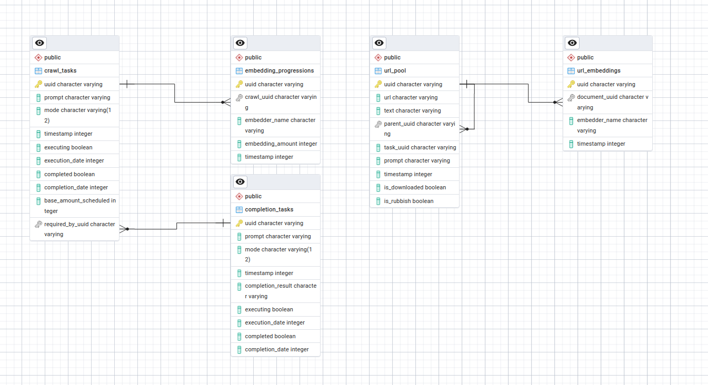

# ResearchChain

#### Langchain project aiming at achieving perpetual research with the help of a chain of ai researching agents.

### Running ResearchChain
Deploy every single worker, database and utility simultaneously
> sudo docker-compose -f docker/docker-compose.yml up

Please note, that webui frontend has to be launched separately. `see below`

### Running webui front-end `user interaction`

Frontend is launched separately to back end, run the following command to start it.
- go to frontend directory: `cd webui/frontend/`
- install dependencies: `npm install`
- start react project: `npm run dev`
- open `http://localhost:3000/` in your browser

### Accessing postgres database
- postgres can be accessed via `pgAdmin`, which is already included in the docker compose,
  so there is no need for any additional packages
- go to `localhost:8081/browser/`
- click `add new server`
- in `name`, write `postgres`
- go to `connection` tab
- in `hostname/address` write `postgres`
- in `username` write `admin` and in `password` write `pass`
- click `save`, the database should be immediately available
- there, you'll see connection statistics as well as the entire schema

### GPU offloading

Automatic GPU offloading is built into Research Chain, 
but requires `nvidia-container-toolkit` to be installed in order to share hardware GPU resources with the containers.

#### Other notes

- The default models can be seen in the `core/models/configurations` folder. 
- We're using python version `3.9`
- `environment.yml` is the linux env, but for macOS (silicon) and windows there are other available
- Apple intel is not supported anymore, but you can still get it working by manually installing
  any missing package that comes up during the program execution.

### This is a monorepo for both a tool, and apps for it:

#### Research Chain
> A set of workers watching for new tasks 24/7. 
> This is the tool part of this project, alone it cannot schedule new tasks,
> unless as a side effect of a previous task.
> Consists of 3 infinitely scalable workers, which together with a 4th auto scheduling worker app,
> create a complete loop.
> This design allows for near infinite scalability potential.

#### Schedulers
> Built in examples of how to interact with Research Chain, the ones
> that we offer are WebUI, with plans for AutoScheduler and NewsScheduler coming soon. 
> These services automatically dispatch, analyze and manage Research Chain. 
> AutoScheduler and NewsScheduler should work alongside Web Interface, 
> to supply constant 24/7 knowledge and news analysis,
> and to expand its knowledge base by scheduling crawls based on the provided areas of interest.

### Flow of operations with WebUI app

### Database schema

---
### Contributing

If you'd like to contribute to this project, 
feel free to reach out to us through my telegram: `https://t.me [slash] latkaignacy`. 
We'll introduce you into this project, 
fix any issues that you may encounter and help you find a good first issue. 
This is a great way to expand your portfolio, as there are nearly endless ways to expand this app,
that we already have planned, and many more which we don't :)

---

THIS SOFTWARE IS INTENDED FOR EDUCATIONAL AND RESEARCH PURPOSES ONLY.
WE ARE NOT RESPONSIBLE FOR ANY ILLICIT USES OF THIS SOFTWARE.
